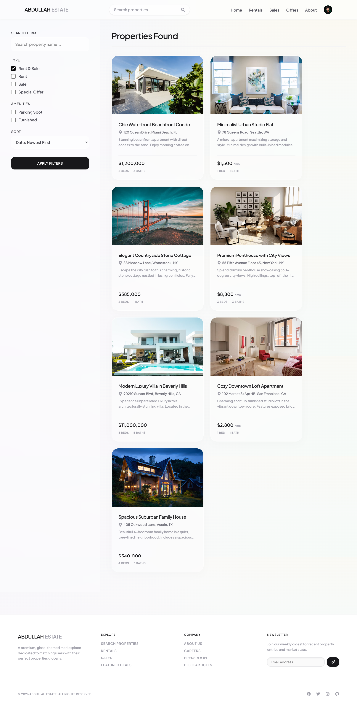
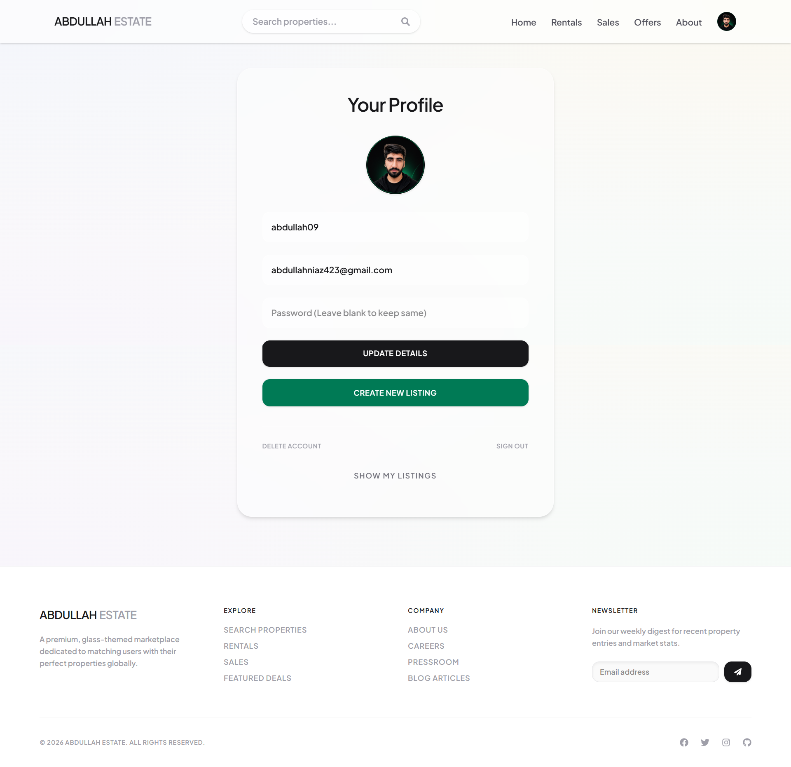

# ABDULLAH ESTATE - MERN Real Estate Marketplace

A modern, full-stack real estate marketplace built from scratch using the MERN stack (MongoDB, Express.js, React, Node.js). This application features a premium **glassmorphism UI layout**, advanced filters, multi-image parallel uploads, direct landlord contacting, and a responsive design.

---

## 📸 Screenshots

### Home Landing Page


### Advanced Search & Filter Sidebar


### User Profile Dashboard


---

## ✨ Key Features

* **Premium Glassmorphic Design**: Clean navbar blurs (`backdrop-blur-md`), translucent card structures, fixed radial mesh gradients, and professional spacing.
* **Property Card Elevations**: Multi-featured listing cards featuring smooth hover zoom images and lift translations (`hover:-translate-y-2`).
* **Advanced Authentication**: Secure signup and signin configurations using JSON Web Tokens (JWT) and Google OAuth integrations.
* **Full CRUD Operations**: Users can list new properties, delete their entries, and update listing data (hydrates state dynamically).
* **Cloudinary Image Upload**: Upload up to 6 high-res images in parallel per property listing with preview grids and custom delete triggers.
* **Dynamic Search & Filtering**: Multi-criteria search panel filtering by type (rent/sale), amenities (parking, furnished), special offers, sorting (price, date), and paginated offsets.
* **Contact Landlord**: Direct communication panel parsing landlord profiles and generating default draft templates via `mailto` triggers.
* **State Persistence**: Efficient state management utilizing Redux Toolkit synced with Redux Persist.

---

## 🛠️ Tech Stack

* **Frontend**: React, Redux Toolkit, Redux Persist, React Router, Tailwind CSS, React Icons
* **Backend**: Node.js, Express.js, cookie-parser
* **Database**: MongoDB (Mongoose ORM)
* **Authentication**: JWT, bcryptjs, Google OAuth
* **Image Hosting**: Cloudinary API

---

## 🚀 Getting Started

Follow these steps to run a copy of the project on your local machine for development and testing.

### Prerequisites

* Node.js and npm installed
* Local MongoDB instance (or MongoDB Atlas cluster)
* Cloudinary credentials (cloud name, upload preset) for listings image uploads

### Installation & Setup

1. **Clone the repository:**
   ```bash
   git clone https://github.com/Abdullah-Niaz/Real-Estate-Marketplace.git
   cd Real-Estate-Marketplace
   ```

2. **Install Backend Dependencies (Root Folder):**
   ```bash
   npm install
   ```

3. **Install Frontend Dependencies (Client Folder):**
   ```bash
   cd client
   npm install
   cd ..
   ```

4. **Configure Environment Variables:**
   * Create a `.env` file in the **root** folder:
     ```env
     PORT=3000
     MONGO_URI=mongodb://localhost:27017/Real-Estate-Marketplace
     JWT_SECRET=YOUR_JWT_SECRET_STRING
     ```
   * Create a `.env` file in the **client** folder:
     ```env
     VITE_FIREBASE_API_KEY=YOUR_FIREBASE_API_KEY
     VITE_CLOUDINARY_CLOUD_NAME=YOUR_CLOUDINARY_CLOUD_NAME
     VITE_CLOUDINARY_UPLOAD_PRESET=YOUR_CLOUDINARY_UPLOAD_PRESET
     ```

5. **Populate Database (Seed Script):**
   To seed the database with a test landlord user (`landlord@example.com` / `password123`) and 7 featured listings, run the seed script from the root folder:
   ```bash
   npm run seed
   ```
   *(Ensure you have registered `"seed": "node api/seed.js"` under the scripts in your root `package.json`, or run `node api/seed.js` directly)*

6. **Run the Application:**
   * **Backend server** (run from root folder):
     ```bash
     npm run dev
     ```
     The backend API will run at `http://localhost:3000`.
   * **Frontend server** (run from client folder):
     ```bash
     cd client
     npm run dev
     ```
     The React application will run at `http://localhost:5173`.
